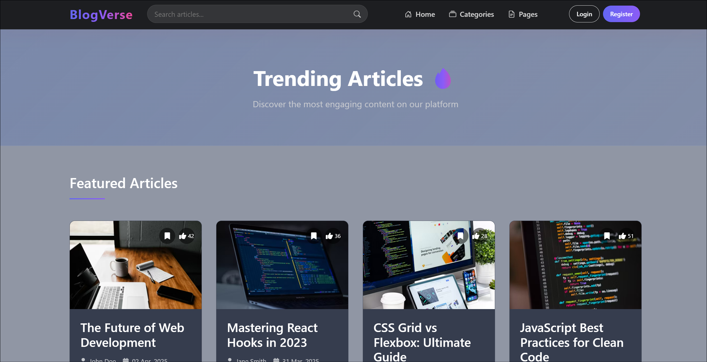

# Blog Application - Full Stack (React + Django + MongoDB)

  


## Table of Contents
- [Blog Application - Full Stack (React + Django + MongoDB)](#blog-application---full-stack-react--django--mongodb)
  - [Table of Contents](#table-of-contents)
  - [Features](#features)
  - [Tech Stack](#tech-stack)
    - [**Frontend**:](#frontend)
    - [**Backend**:](#backend)
    - [**Database**:](#database)
  - [Requirements](#requirements)
  - [Prerequisites](#prerequisites)
  - [Installation](#installation)
    - [Frontend Setup](#frontend-setup)
    - [Backend Setup](#backend-setup)
  - [Running the Application](#running-the-application)
  - [API Endpoints](#api-endpoints)
  - [Deployment](#deployment)
    - [Frontend Deployment (Vercel)](#frontend-deployment-vercel)
    - [Backend Deployment (AWS Elastic Beanstalk)](#backend-deployment-aws-elastic-beanstalk)
    - [MongoDB Deployment (Atlas)](#mongodb-deployment-atlas)
  - [Testing](#testing)
  - [Contributing](#contributing)
  - [License](#license)
  - [Contact](#contact)

## Features

- **User Authentication**: Secure signup/login with JWT
- **Blog Management**:
  - Create, read, update, and delete blog posts
  - Rich text content support
  - Only logged-in users can create or manage blogs
- **Public Blog Access**:
  - Once published, blogs are viewable by everyone
  - Pagination support for listing blogs
- **Responsive Design**: Works on desktop, tablet, and mobile
- **Cloud Deployment**: Hosted on AWS/GCP/Azure

## Tech Stack

### **Frontend**:
- React.js (Vite)
- Tailwind CSS + shadcn/ui
- Axios for API calls
- React Router for navigation
- React Hook Form for forms

### **Backend**:
- Django REST Framework
- MongoDB (via Djongo & Mongoose)
- JWT Authentication
- Django CORS Headers

### **Database**:
- MongoDB (NoSQL)

## Requirements

- User authentication using email and password.
- Only logged-in users can create, edit, or delete blogs.
- Each blog should have a title and content.
- Published blogs should be viewable by everyone (including unauthenticated users).
- Public page to list all blogs with pagination.
- Blogs should be stored in MongoDB.
- The application should be responsive on both desktop and mobile.
- The frontend should be built with React, and the backend with Django.
- Deployment on a cloud-based platform such as AWS, GCP, or Azure.

## Prerequisites

Before you begin, ensure you have installed:
- Node.js (v18+)
- Python (3.10+)
- MongoDB (6.0+)
- Git

## Installation

### Frontend Setup

1. Clone the repository:
```bash
git clone https://github.com/its-kundan/blog-app.git
cd blog-app/frontend
```
2. Install dependencies:
```bash
npm install
```
3. Configure environment variables:
Create a `.env` file in the frontend directory:
```env
VITE_API_URL=http://localhost:8000/api
```

### Backend Setup

1. Navigate to backend directory:
```bash
cd ../backend
```
2. Create and activate a virtual environment:
```bash
python -m venv venv
source venv/bin/activate  # On Windows: venv\Scripts\activate
```
3. Install dependencies:
```bash
pip install -r requirements.txt
```
4. Configure environment variables:
Create a `.env` file in the backend directory:
```env
DEBUG=True
SECRET_KEY=your-secret-key-here
DB_NAME=blogdb
DB_HOST=localhost
DB_PORT=27017
JWT_SECRET=your-jwt-secret
ALLOWED_HOSTS=localhost,127.0.0.1
CORS_ALLOWED_ORIGINS=http://localhost:5173
```
5. Apply migrations:
```bash
python manage.py migrate
```

## Running the Application

1. **Start MongoDB** (if not running):
```bash
mongod
```
2. **Start Backend Server**:
```bash
cd backend
python manage.py runserver
```
3. **Start Frontend Development Server**:
```bash
cd frontend
npm run dev
```

The application should now be running:
- Frontend: [http://localhost:5173](http://localhost:5173)
- Backend: [http://localhost:8000](http://localhost:8000)
- API Docs: [http://localhost:8000/swagger/](http://localhost:8000/swagger/)

## API Endpoints

| Endpoint | Method | Description | Authentication |
|----------|--------|-------------|----------------|
| `/api/auth/register` | POST | User registration | Public |
| `/api/auth/login` | POST | User login | Public |
| `/api/auth/me` | GET | Get current user | Required |
| `/api/blogs` | GET | List all blogs (paginated) | Public |
| `/api/blogs` | POST | Create new blog | Required |
| `/api/blogs/{id}` | GET | Get single blog | Public |
| `/api/blogs/{id}` | PUT | Update blog | Author only |
| `/api/blogs/{id}` | DELETE | Delete blog | Author only |

## Deployment

### Frontend Deployment (Vercel)

1. Install Vercel CLI:
```bash
npm install -g vercel
```
2. Deploy:
```bash
cd frontend
vercel
```

### Backend Deployment (AWS Elastic Beanstalk)

1. Install EB CLI:
```bash
pip install awsebcli
```
2. Initialize EB:
```bash
cd backend
eb init -p python-3.10 blog-backend
```
3. Create environment and deploy:
```bash
eb create blog-env
```

### MongoDB Deployment (Atlas)

1. Create a free cluster on MongoDB Atlas
2. Update your `.env` with the Atlas connection string
3. Whitelist your IP address in Atlas network access

## Testing

Run frontend tests:
```bash
cd frontend
npm run test
```

Run backend tests:
```bash
cd backend
python manage.py test
```

## Contributing

1. Fork the repository
2. Create your feature branch (`git checkout -b feature/AmazingFeature`)
3. Commit your changes (`git commit -m 'Add some AmazingFeature'`)
4. Push to the branch (`git push origin feature/AmazingFeature`)
5. Open a Pull Request

## License

Distributed under the MIT License. See `LICENSE` for more information.

## Contact

Kundan Kumar - [@kundan_k_](https://x.com/kundan_k_) - kundan515kk@gmail.com  
Project Link: [https://github.com/its-kundan/blog-app](https://github.com/its-kundan/blog-app)

